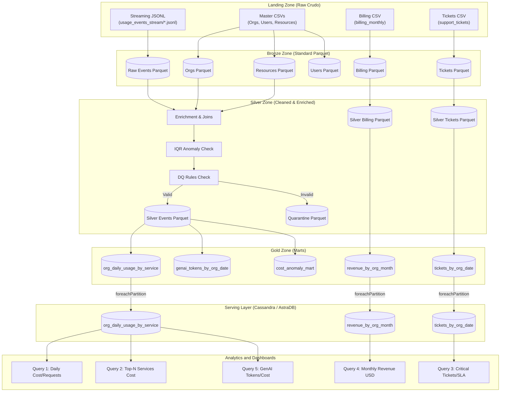

# Cloud Provider Analytics Platform - MVP Técnico
**Materia:** Big Data - Primer Cuatrimestre 2026 (ITBA)  
**Proyecto:** Cloud Provider Analytics (ETL + Streaming + Serving en Cassandra)  
**Entrega:** Segundo Parcial (MVP Técnico)  

### Integrantes del Grupo
*   **María Mercedes Baron** - [mbaron@itba.edu.ar](mailto:mbaron@itba.edu.ar)
*   **Axel Marcelo Castro Benza** - [acastrobenza@itba.edu.ar](mailto:acastrobenza@itba.edu.ar)
*   **Lautaro Joaquín Farías** - [lfarias@itba.edu.ar](mailto:lfarias@itba.edu.ar)
*   **Nicolás Matías Kim** - [nkim@itba.edu.ar](mailto:nkim@itba.edu.ar)
*   **Andrés Podgorny** - [apodgorny@itba.edu.ar](mailto:apodgorny@itba.edu.ar)

---

## Tabla de Contenidos
1. [Guía de Inicio Rápido para Ejecución Local](#guía-de-inicio-rápido-para-ejecución-local)
2. [Estructura del Proyecto y Modularización](#1-estructura-del-proyecto-y-modularización)
3. [Diagrama de Arquitectura (Patrón Lambda)](#2-diagrama-de-arquitectura-patrón-lambda)
4. [Decisiones de Ingeniería y Particiones](#3-decisiones-de-ingeniería-y-particiones)
5. [Estrategia de Calidad de Datos y Quarantine](#4-estrategia-de-calidad-de-datos-y-quarantine)
6. [Diseño Query-First en Cassandra](#5-diseño-query-first-en-cassandra)
7. [Evidencias de Ejecución y Resultados](#6-evidencias-de-ejecución-y-resultados)
8. [Verificación de Idempotencia](#7-verificación-de-idempotencia)

---

## Guía de Inicio Rápido para Ejecución Local

Sigue los siguientes pasos exactos para preparar e iniciar el pipeline modular en tu entorno local:

### Prerrequisitos del Sistema
Antes de comenzar, asegúrate de tener instalado en tu sistema:
*   **Java JDK (versión 8, 11 o 17):** Obligatorio para ejecutar Apache Spark en modo local.
*   **Docker (Desktop o Engine):** Obligatorio para ejecutar el contenedor local de Cassandra.

### Paso 1: Levantar e Iniciar Cassandra
Si es la primera vez que creas el contenedor:
```bash
docker run --name local-cassandra -p 9042:9042 -d cassandra:latest
```

Si el contenedor ya existe en Docker (para evitar conflictos de nombre):
```bash
docker start local-cassandra
```

### Paso 2: Crear el Entorno Virtual e Instalar Dependencias
```bash
# Crear entorno virtual de python
python3 -m venv venv

# Activar el entorno virtual
source venv/bin/activate

# Actualizar el gestor de paquetes pip
pip install --upgrade pip

# Instalar las librerías necesarias
pip install pyspark cassandra-driver pandas pyarrow
```

### Paso 3: Ejecutar el Pipeline de Datos
Para correr el pipeline de forma correcta usando las librerías del entorno virtual:
```bash
# Opción A (Estando dentro del entorno activado):
python main.py

# Opción B (Desde cualquier terminal en el directorio raíz):
venv/bin/python main.py
```
---

## 1. Estructura del Proyecto y Modularización

El pipeline de procesamiento de datos ha sido modularizado para cumplir con buenas prácticas de ingeniería de software. Cada fase del data lake (Landing ➔ Bronze ➔ Silver ➔ Gold ➔ Serving) está aislada en componentes cohesivos y mantenibles:

```
tp_bigdata/
├── Docs/                              # Consignas de la materia y correcciones
├── datalake/                          # Data Lake unificado (Landing, Bronze, Silver, Gold, Quarantine)
├── checkpoints/                       # Directorio de control para Spark Structured Streaming
├── venv/                              # Entorno virtual de Python
├── main.py                            # Orquestador del pipeline (Punto de entrada de ejecución)
├── cql_queries.cql                    # Scripts CQL de base de datos Cassandra
├── src/                               # Módulos del pipeline
│   ├── __init__.py                    # Inicializador de paquete Python
│   ├── config.py                      # Configuración, rutas y esquemas explícitos de Spark
│   ├── bronze.py                      # Ingesta Batch y Streaming a Bronze
│   ├── silver.py                      # Conformance, enriquecimiento de datos y desvío a Quarantine
│   ├── gold.py                        # Generación de todos los marts analíticos (FinOps, Soporte y GenAI)
│   └── serving.py                     # Serving distribuido en Cassandra, las 5 consultas e idempotencia
└── README.md                          # Este documento explicativo
```

---

## 2. Diagrama de Arquitectura (Patrón Lambda)

A continuación se muestra el flujo de datos del data lake implementado. El pipeline procesa maestros vía Batch y eventos de uso near real-time vía Streaming:



---

## 3. Decisiones de Ingeniería y Particiones

### Justificación de Decisiones
*   **Patrón Lambda:** Permite conciliar la analítica near real-time de eventos de uso cloud con procesos batch para datos estáticos y facturación mensual. La capa batch garantiza consistencia absoluta de los datos maestros de las organizaciones, mientras que el pipeline de streaming ingesta eventos de uso continuamente para la serving layer.
*   **Structured Streaming de PySpark:** Elegido por su tolerancia a fallos, soporte nativo de watermarking y facilidades para realizar deduplicación y manejo de datos tardíos (late data).
*   **Cassandra como Capa de Serving (AstraDB):** Cassandra es una base de datos NoSQL columnar distribuida que funciona bajo el principio de **Query-First**. Diseñamos las claves primarias compuestas físicamente alineadas con las consultas de negocio para evitar costosos table scans en producción.
*   **Carga Distribuida Paralela (`foreachPartition`):** Para evitar el cuello de botella del Driver de Spark (antipatrón de usar `.collect()`), implementamos la escritura paralela mediante `foreachPartition` ejecutada por los Spark executors directamente a Cassandra.

### Estrategia de Particionamiento en el Data Lake
Para maximizar la eficiencia en Spark y acelerar los tiempos de ejecución de las queries, aplicamos particionamientos lógicos:
*   **`customers_orgs` (Bronze):** Particionado por `hq_region` (optimiza filtros geográficos).
*   **`users` (Bronze):** Particionado por `role` (optimiza búsquedas de tipos de usuarios).
*   **`resources` (Bronze):** Particionado por `service` (acelera los joins de enriquecimiento posteriores).
*   **`usage_events` (Bronze y Silver):** Particionado por `service` y `usage_date` (reduce drásticamente la lectura de particiones durante consultas de fechas y tipos de consumo).
*   **`support_tickets` (Bronze y Silver):** Particionado por `category` y `ticket_date` respectivamente (optimiza análisis analíticos temporales).

---

## 4. Estrategia de Calidad de Datos y Quarantine

El pipeline implementa una **zona de Quarantine** física en Parquet para aislar registros anómalos o con inconsistencias estructurales. Se evalúan **3 reglas de calidad activas**:

1.  **Integridad de Eventos:** El identificador del evento (`event_id`) no puede ser nulo.
2.  **Integridad Financiera:** Los incrementos de costo deben ser mayores o iguales a `-0.01` (`cost_usd_increment >= -0.01`). Los registros con costos fuera de este rango se desvían a cuarentena.
3.  **Consistencia Técnica:** No se admiten registros que contengan un consumo cuantitativo (`value IS NOT NULL`) pero carezcan de una unidad de medida asociada (`unit IS NULL`).

### Detección Estadística de Anomalías (IQR / P-tiles)
Para el flag de anomalías en Silver, implementamos el algoritmo de **Rango Intercuartílico (IQR / p-tiles)** dinámico en Spark SQL:
* Calculamos los percentiles 25 ($Q_1$) y 75 ($Q_3$) de `daily_cost_usd` agrupados por cada `service` usando `percentile_approx`.
* Definimos el límite superior como $Q_3 + 1.5 \times IQR$ y el inferior como $Q_1 - 1.5 \times IQR$ (con una tolerancia mínima ante varianza cero).
* Cualquier registro de consumo que supere o esté por debajo de dichos límites se marca con `anomaly_flag = True` en la zona Silver.

---

## 5. Diseño Query-First en Cassandra

Modelamos la serving layer con **3 tablas** específicas para responder a las consultas analíticas del negocio en tiempo récord:

```sql
CREATE KEYSPACE IF NOT EXISTS cloud_analytics
WITH replication = {'class': 'SimpleStrategy', 'replication_factor': 1};

USE cloud_analytics;

-- Tabla 1: Daily Usage by Org and Service (FinOps y GenAI)
CREATE TABLE IF NOT EXISTS org_daily_usage_by_service (
    org_id text,
    service text,
    usage_date date,
    total_cost_usd double,
    total_requests double,
    total_cpu_hours double,
    total_storage_gb_hours double,
    total_genai_tokens bigint,
    total_carbon_kg double,
    PRIMARY KEY ((org_id), service, usage_date)
) WITH CLUSTERING ORDER BY (service ASC, usage_date DESC);

-- Tabla 2: Support Tickets by Org and Date (Métricas de Soporte)
CREATE TABLE IF NOT EXISTS tickets_by_org_date (
    org_id text,
    ticket_date date,
    total_tickets bigint,
    critical_tickets_count bigint,
    avg_csat double,
    sla_breach_rate double,
    PRIMARY KEY ((org_id), ticket_date)
) WITH CLUSTERING ORDER BY (ticket_date DESC);

-- Tabla 3: Monthly Revenue by Org and Month (Facturación normalizada)
CREATE TABLE IF NOT EXISTS revenue_by_org_month (
    org_id text,
    month date,
    total_subtotal_usd double,
    total_credits_usd double,
    total_taxes_usd double,
    net_revenue_usd double,
    PRIMARY KEY ((org_id), month)
) WITH CLUSTERING ORDER BY (month DESC);
```

---

## 6. Evidencias de Ejecución y Resultados

Al ejecutar el comando `venv/bin/python main.py` en la terminal, el pipeline procesa las fuentes de datos y reporta los siguientes resultados:

### Ingestas de Datos Crudos (Bronze)
*   **Customers Orgs:** 80 organizaciones (particionado por `hq_region`).
*   **Users:** 800 usuarios (particionado por `role`).
*   **Resources:** 400 recursos (particionado por `service`).
*   **Billing Monthly:** 240 facturas (particionado por `currency`).
*   **Support Tickets:** 1000 tickets (particionado por `category`).
*   **NPS Surveys:** 92 encuestas.
*   **Marketing Touches:** 1500 toques (particionado por `channel`).

### Procesamientos y Calidad de Datos (Silver y Gold)
*   **Eventos Silver Validados y Conformados:** 41.015 eventos correctos.
*   **Eventos Desviados a Quarantine:** 2.185 eventos corruptos (con costos anómalos o sin unidad asociada).
*   **Tickets Silver Procesados:** 1.000 tickets limpios (SLA y CSAT corregidos).
*   **Registro de Anomalías (IQR):** 82 anomalías de costo identificadas y catalogadas en Gold.

### Estructura Física y Tamaños del Data Lake (Evidencia de Particionado)
A continuación se detalla el árbol de directorios y tamaños de almacenamiento del Data Lake (`datalake/`), demostrando la aplicación de un particionamiento sensato y optimizado para Spark SQL:

```
datalake/ (30 MB total)
├── bronze/ (2.9 MB)
│   ├── customers_orgs/ [particionado por hq_region] (116 KB)
│   │   ├── hq_region=us-east/ (16 KB)
│   │   ├── hq_region=sa-east/ (16 KB)
│   │   └── ...
│   ├── users/ [particionado por role] (108 KB)
│   │   ├── role=developer/ (16 KB)
│   │   ├── role=data_engineer/ (20 KB)
│   │   └── ...
│   ├── resources/ [particionado por service] (96 KB)
│   │   ├── service=compute/ (16 KB)
│   │   └── ...
│   ├── billing_monthly/ [particionado por currency] (60 KB)
│   │   ├── currency=USD/ (20 KB)
│   │   └── ...
│   ├── usage_events/ [particionado por service] (2.4 MB)
│   │   ├── service=compute/ (620 KB)
│   │   ├── service=database/ (396 KB)
│   │   ├── service=storage/ (404 KB)
│   │   └── ...
│   ├── support_tickets/ [particionado por category] (104 KB)
│   └── marketing_touches/ [particionado por channel] (88 KB)
│
├── silver/ (14 MB)
│   ├── usage_events/ [particionado por usage_date y service] (11 MB)
│   │   ├── usage_date=2025-08-31/
│   │   │   ├── service=compute/
│   │   │   └── service=storage/
│   │   └── ...
│   ├── support_tickets/ [particionado por ticket_date] (3.0 MB)
│   ├── billing_monthly/ [normalizado a USD] (52 KB)
│   └── nps_surveys/ (16 KB)
│
├── gold/ (492 KB)
│   ├── org_daily_usage_by_service/ (308 KB)
│   ├── revenue_by_org_month/ (24 KB)
│   ├── tickets_by_org_date/ (20 KB)
│   ├── cost_anomaly_mart/ (104 KB)
│   └── genai_tokens_by_org_date/ (32 KB)
│
└── quarantine/ (88 KB)
    └── usage_events/ (88 KB)
```

### Resultados de las Consultas sobre Cassandra (Serving Layer)

#### Consulta 1: Costos y requests diarios para la Org `'org_c11ertj5'` y Servicio `'compute'`:
```
Date         | Service      | Total Cost (USD) | Total Requests
-----------------------------------------------------------------
2025-08-31   | compute      | 170.7746         | 349
2025-08-30   | compute      | 1.5982           | 0
2025-08-29   | compute      | 11.0387          | 134
2025-08-28   | compute      | 2.2645           | 0
2025-08-27   | compute      | 31.6309          | 382
2025-08-26   | compute      | 23.7311          | 266
```

#### Consulta 2: Top-N Servicios por costo acumulado entre el 15 y 30 de agosto para la Org `'org_c11ertj5'`:
```
Rank  | Service         | Cumulative Cost (USD)
--------------------------------------------------
1     | compute         | 199.2243
2     | genai           | 124.3508
3     | database        | 108.4585
4     | storage         | 96.4147
```

#### Consulta 3: Evolución de tickets críticos y tasa de SLA breach por día (últimos 30 días) para `'org_c11ertj5'`:
```
Date         | Total Tickets   | Critical Tkts   | Avg CSAT   | SLA Breach Rate
---------------------------------------------------------------------------
2025-08-30   | 1               | 0               | 3.00       | 0.00%
2025-08-16   | 1               | 0               | 3.00       | 0.00%
2025-08-07   | 1               | 0               | 5.00       | 100.00%
2025-08-03   | 1               | 0               | 2.00       | 0.00%
```

#### Consulta 4: Revenue mensual con créditos/impuestos normalizados a USD para `'org_c11ertj5'`:
```
Month        | Subtotal (USD)   | Credits (USD)   | Taxes (USD)   | Net Revenue (USD)
--------------------------------------------------------------------------------
2025-08-01   | 981.88           | 0.00            | 206.20        | 1188.08
2025-07-01   | 2.01             | 0.00            | 0.42          | 2.43
2025-06-01   | 1900.91          | 10.96           | 399.19        | 2289.13
```

#### Consulta 5: Tokens GenAI y costo estimado por día para la Org `'org_c11ertj5'`:
```
Date         | Total GenAI Tokens   | Total Cost (USD)
-------------------------------------------------------
2025-08-31   | 3392                 | 31.1266
2025-08-26   | 761                  | 0.1375
2025-08-25   | 3400                 | 32.1182
2025-08-24   | 1733                 | 16.4558
2025-08-23   | 3077                 | 19.1973
... (mostrando las primeras 5 filas)
```

---

## 7. Verificación de Idempotencia

El pipeline valida la idempotencia ejecutando un segundo ciclo completo de guardado en Cassandra de forma distribuida. Gracias a las claves primarias diseñadas para *Query-First*, Cassandra realiza *Upserts* atómicos manteniendo estables los recuentos:

```
Record counts before re-running ingestion:
 - org_daily_usage_by_service: 12109
 - tickets_by_org_date: 944
 - revenue_by_org_month: 240

Re-running Gold to Cassandra loading...
Distributed loading to Cassandra completed successfully.

Record counts after re-running ingestion:
 - org_daily_usage_by_service: 12109
 - tickets_by_org_date: 944
 - revenue_by_org_month: 240

SUCCESS: Idempotency OK! All table counts remain unchanged after re-run.
=== MODULAR PIPELINE COMPLETED SUCCESSFULLY ===
```
