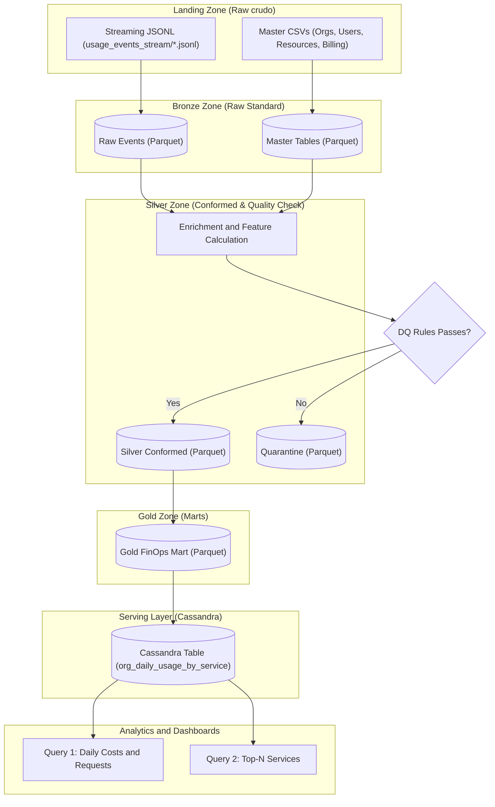

# Cloud Provider Analytics Platform - MVP Técnico Modularizado
**Materia:** Big Data - Primer Cuatrimestre 2026 (ITBA)  
**Proyecto:** Cloud Provider Analytics (ETL + Streaming + Serving en Cassandra)  
**Entrega:** Segundo Parcial (MVP Técnico)  

### 👥 Integrantes del Grupo
*   **Andrés Podgorny** - [apodgorny@itba.edu.ar](mailto:apodgorny@itba.edu.ar)
*   **María Mercedes Baron** - [mbaron@itba.edu.ar](mailto:mbaron@itba.edu.ar)
*   **Axel Marcelo Castro Benza** - [acastrobenza@itba.edu.ar](mailto:acastrobenza@itba.edu.ar)
*   **Lautaro Joaquín Farías** - [lfarias@itba.edu.ar](mailto:lfarias@itba.edu.ar)
*   **Nicolás Matías Kim** - [nkim@itba.edu.ar](mailto:nkim@itba.edu.ar)

**Estado de la Entrega:** 🚀 **Completado, Modularizado y Verificado End-to-End**

---

## 📋 Tabla de Contenidos
1. [Estructura del Proyecto y Modularización](#1-estructura-del-proyecto-y-modularización)
2. [Diagrama de Arquitectura (Patrón Lambda)](#2-diagrama-de-arquitectura-patrón-lambda)
3. [Decisiones de Ingeniería y Particiones](#3-decisiones-de-ingeniería-y-particiones)
4. [Estrategia de Calidad de Datos y Quarantine](#4-estrategia-de-calidad-de-datos-y-quarantine)
5. [Diseño Query-First en Cassandra](#5-diseño-query-first-en-cassandra)
6. [Guía de Inicio Rápido para Ejecución Local](#6-guía-de-inicio-rápido-para-ejecución-local)
7. [Evidencias de Ejecución y Resultados](#7-evidencias-de-ejecución-y-resultados)
8. [Verificación de Idempotencia](#8-verificación-de-idempotencia)

---

## 1. Estructura del Proyecto y Modularización

El pipeline de procesamiento de datos ha sido modularizado para cumplir con buenas prácticas de ingeniería de software. Cada fase del data lake (Landing ➔ Bronze ➔ Silver ➔ Gold ➔ Serving) está aislada en componentes cohesivos y mantenibles:

```
tp_bigdata/
├── Docs/                              # Consignas de la materia y correcciones
├── datalake/                          # Data Lake unificado (Landing, Bronze, Silver, Gold, Quarantine)
├── checkpoints/                       # Directorio de control para Spark Structured Streaming
├── venv/                              # Entorno virtual de Python
├── main.py                            # Orquestador del pipeline (Punto de entrada de ejecución)
├── cql_queries.cql                    # Scripts CQL de base de datos Cassandra
├── src/                               # Módulos del pipeline
│   ├── __init__.py                    # Inicializador de paquete Python
│   ├── config.py                      # Configuración, rutas y esquemas explícitos de Spark
│   ├── bronze.py                      # Ingesta Batch y Streaming a Bronze
│   ├── silver.py                      # Conformance, enriquecimiento de datos y desvío a Quarantine
│   ├── gold.py                        # Datamart FinOps (Daily group by org/service)
│   └── serving.py                     # Serving en Cassandra, queries analíticas e idempotencia
└── README.md                          # Este documento explicativo
```

---

## 2. Diagrama de Arquitectura (Patrón Lambda)

A continuación se muestra el flujo de datos del data lake implementado. El pipeline procesa maestros vía Batch y eventos de uso near real-time vía Streaming:



---

## 3. Decisiones de Ingeniería y Particiones

### 🛠️ Justificación de Decisiones
*   **Patrón Lambda:** Permite conciliar la analítica near real-time de eventos de uso cloud con procesos batch para datos estáticos y facturación mensual. La capa batch garantiza consistencia absoluta de los datos maestros de las organizaciones, mientras que el pipeline de streaming ingesta eventos de uso continuamente para la serving layer.
*   **Structured Streaming de PySpark:** Elegido por su tolerancia a fallos, soporte nativo de watermarking y facilidades para realizar deduplicación y manejo de datos tardíos (late data).
*   **Cassandra como Capa de Serving (AstraDB):** Cassandra es una base de datos NoSQL columnar distribuida que funciona bajo el principio de **Query-First**. Diseñamos la clave primaria compuesta alineada físicamente con las consultas de negocio para evitar costosos table scans en producción.

### 📁 Estrategia de Particionamiento en el Data Lake
Para maximizar la eficiencia en Spark y acelerar los tiempos de ejecución de las queries, aplicamos particionamientos lógicos:
*   **`customers_orgs` (Bronze):** Particionado por `hq_region` (optimiza filtros geográficos).
*   **`users` (Bronze):** Particionado por `role` (optimiza búsquedas de tipos de usuarios).
*   **`resources` (Bronze):** Particionado por `service` (acelera los joins de enriquecimiento posteriores).
*   **`usage_events` (Bronze y Silver):** Particionado por `service` y `usage_date` (reduce drásticamente la lectura de particiones durante consultas de fechas y tipos de consumo).

---

## 4. Estrategia de Calidad de Datos y Quarantine

El pipeline implementa una **zona de Quarantine** física en Parquet para aislar registros anómalos o con inconsistencias estructurales. Se evalúan **3 reglas de calidad activas**:

1.  **Integridad de Eventos:** El identificador del evento (`event_id`) no puede ser nulo.
2.  **Integridad Financiera:** Los incrementos de costo deben ser mayores o iguales a `-0.01` (`cost_usd_increment >= -0.01`). Los registros con costos fuera de este rango se desvían a cuarentena. Si un costo supera un umbral extremo de `$100.0` o es menor a `$0.0`, se marca adicionalmente en Silver con un `anomaly_flag = True`.
3.  **Consistencia Técnica:** No se admiten registros que contengan un consumo cuantitativo (`value IS NOT NULL`) pero carezcan de una unidad de medida asociada (`unit IS NULL`).

> [!IMPORTANT]
> Los registros que fallen cualquiera de estos tres checks son aislados de inmediato en `datalake/quarantine/usage_events/`.

---

## 5. Diseño Query-First en Cassandra

Modelamos la tabla de Cassandra `org_daily_usage_by_service` con el enfoque **Query-First** para responder a las consultas analíticas del negocio en tiempo récord:

```sql
CREATE KEYSPACE IF NOT EXISTS cloud_analytics
WITH replication = {'class': 'SimpleStrategy', 'replication_factor': 1};

USE cloud_analytics;

CREATE TABLE IF NOT EXISTS org_daily_usage_by_service (
    org_id text,
    service text,
    usage_date date,
    total_cost_usd double,
    total_requests double,
    total_cpu_hours double,
    total_storage_gb_hours double,
    total_genai_tokens bigint,
    total_carbon_kg double,
    PRIMARY KEY ((org_id), service, usage_date)
) WITH CLUSTERING ORDER BY (service ASC, usage_date DESC);
```

### 🔑 Lógica de Claves:
*   **Partition Key `((org_id))`:** Agrupa y distribuye los registros de cada organización físicamente en el clúster.
*   **Clustering Keys `(service, usage_date)`:** 
    *   `service` permite filtrar búsquedas por un servicio específico de la organización.
    *   `usage_date DESC` almacena físicamente las filas por fecha descendente, permitiendo queries analíticas temporales ultrarrápidas.

---

## 6. Guía de Inicio Rápido para Ejecución Local

Sigue los siguientes pasos exactos para preparar e iniciar el pipeline modular en tu entorno local:

### Paso 1: Levantar e Iniciar Cassandra
Si es la primera vez que creas el contenedor:
```bash
docker run --name local-cassandra -p 9042:9042 -d cassandra:latest
```

Si el contenedor ya existe en Docker (para evitar conflictos de nombre):
```bash
docker start local-cassandra
```

### Paso 2: Crear el Entorno Virtual e Instalar Dependencias
```bash
# Crear entorno virtual de python
python3 -m venv venv

# Activar el entorno virtual
source venv/bin/activate

# Actualizar el gestor de paquetes pip
pip install --upgrade pip

# Instalar las librerías necesarias
pip install pyspark cassandra-driver pandas pyarrow
```

### Paso 3: Ejecutar el Pipeline de Datos
Para correr el pipeline de forma correcta usando las librerías del entorno virtual:
```bash
# Opción A (Estando dentro del entorno activado):
python main.py

# Opción B (Desde cualquier terminal en el directorio raíz):
venv/bin/python main.py
```

## 7. Evidencias de Ejecución y Resultados

Al ejecutar el comando `venv/bin/python main.py` en la terminal, el pipeline reporta de manera transparente las siguientes métricas exactas:

### Ingestas de Datos Crudos (Bronze)
*   **Customers Orgs:** 80 organizaciones ingestadas exitosamente (particionado por `hq_region`).
*   **Users:** 800 usuarios ingestados exitosamente (particionado por `role`).
*   **Resources:** 400 recursos ingestados exitosamente (particionado por `service`).
*   **Billing Monthly:** 240 facturas consolidadas exitosamente (particionado por `currency`).

### Procesamientos y Calidad de Datos (Silver)
El motor de PySpark procesó los eventos en micro-lotes estructurados aplicando las reglas de calidad activas:
*   **Eventos Silver Validados y Conformados:** 41.015 eventos correctos.
*   **Eventos Desviados a Quarantine:** 2.185 eventos corruptos (con costos anómalos o sin unidad asociada).

### Carga y Agregación de Negocio (Gold)
*   **Filas del Datamart FinOps en Gold:** 12.109 registros diarios consolidados.
*   **Carga a Cassandra (Serving):** Inserción exitosa de 12.109 filas en el Keyspace `cloud_analytics`.

### Resultados de Consultas Demo sobre Cassandra

#### Consulta 1: Costos y requests diarios para la Org `'org_c11ertj5'` y Servicio `'compute'`:
```
Date         | Service      | Total Cost (USD) | Total Requests
-----------------------------------------------------------------
2025-08-31   | compute      | 170.7746         | 349
2025-08-30   | compute      | 1.5982           | 0
2025-08-29   | compute      | 11.0387          | 134
2025-08-28   | compute      | 2.2645           | 0
2025-08-27   | compute      | 31.6309          | 382
2025-08-26   | compute      | 23.7311          | 266
2025-08-25   | compute      | 1.3770           | 0
2025-08-24   | compute      | 0.4605           | 0
2025-08-23   | compute      | 16.2852          | 131
2025-08-22   | compute      | 19.1889          | 229
... (mostrando las primeras 10 filas)
```

#### Consulta 2: Top-N Servicios por costo acumulado entre el 15 y 30 de agosto para la Org `'org_c11ertj5'`:
```
Rank  | Service         | Cumulative Cost (USD)
--------------------------------------------------
1     | compute         | 199.2243
2     | genai           | 124.3508
3     | database        | 108.4585
4     | storage         | 96.4147
```

---

## 8. Verificación de Idempotencia

El orquestador de datos prueba la tolerancia a fallos ejecutando un segundo ciclo completo de carga masiva en Cassandra. Gracias al diseño de clave primaria única (`PRIMARY KEY`), Cassandra procesa la recarga como un **Upsert atómico** sin duplicar filas:

```
--- Phase 7: Verification of Idempotency ---
Record count in Cassandra before re-running ingestion: 12109
Re-running Gold to Cassandra loading...
Connecting to local Cassandra to load 12109 records...
Successfully loaded 12109 records into Cassandra.
Record count in Cassandra after re-running ingestion:  12109

SUCCESS: Idempotency OK! Count remains unchanged after re-run.
=== MODULAR PIPELINE COMPLETED SUCCESSFULLY ===
```
